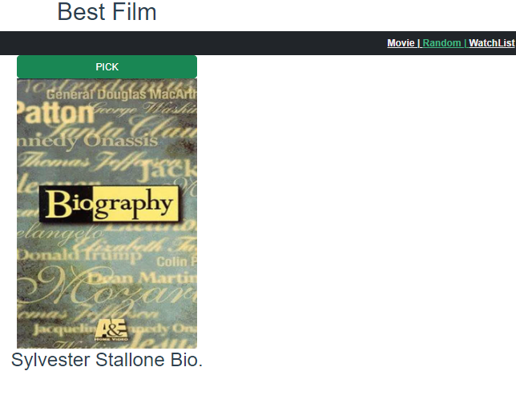
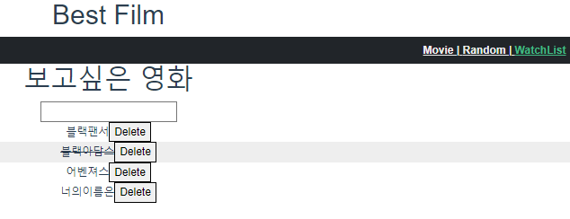

# PJT 09. Vue를 활용한 SPA 구성

## 요구사항

## 프로젝트 구조

.
├─ index.html
├─ webpack.config.js
├─ package.json
└─ src

    ├─ assets

    ├─ components

        ├─ HelloWorld.vue

        ├─ MovieCard.vue

        ├─ WatchListForm.vue

        ├─ WatchListItem.vue

    ├─ plugins

        ├─ axios.js

    ├─ router

        ├─ index.js

    ├─ store

        ├─ index.js

    ├─ views

        ├─ MovieView.vue

        ├─ RandomView.vue

        ├─ WatchListView.vue

## router view

- A. Movie

| Path        | Component     | Description  |
| ----------- | ------------- | ------------ |
| /movies     | MovieView     | 전체 영화 목록 페이지 |
| /random     | RandomVIew    | 랜덤 영화 출력 페이지 |
| /watch-list | WatchListVIew | 영화 검색 출력 페이지 |

## store/index.js

```jsx
import Vue from 'vue'
import Vuex from 'vuex'
import axios from 'axios'
import _ from 'lodash'
const API_KEY = '54f36fb75007c2e17a09cf9651dcdae2'

Vue.use(Vuex)

export default new Vuex.Store({
  state: {
    MovieJsonData: null,
    randomMovie: null,
    movies:[

    ],
  },
  getters: {
    getMovieJsonData(state) {
      return state.MovieJsonData
    },
    getRandomMovieData(state) {
      return state.randomMovie
    },
  },
  mutations: {
    GET_MOVIE_JSON_DATA(state, results) {
      state.MovieJsonData = results
    },
    GET_RANDOM_MOVIE_DATA(state, result) {
      state.randomMovie = result
    },
    CREATE_MOVIE(state,movieItem){
      state.movies.push(movieItem)
    },
    DELETE_MOVIE (state, movieItem) {
      const index = state.movies.indexOf(movieItem)
      state.movies.splice(index, 1)
    },
    UPDATE_MOVIE_STATUS (state, movieItem) {
      state.movies = state.movies.map( (movie) => {
        if (movie === movieItem) {
          movie.isCompleted = !movie.isCompleted
        }
        return movie
      })
    },
  },
  actions: {
    getMovieJson(context) {
      const url = '<https://api.themoviedb.org/3/movie/popular>'
      const params= {
        api_key: API_KEY,
        language: 'ko-KR',
        region: 'KR',
        adult: 'true',
      }
      axios.get(url, { params })
      .then((response) => {
        console.log(response.data)
        context.commit('GET_MOVIE_JSON_DATA', response.data.results)
      })
    },
    getRandomJson(context) {
      const url = '<https://api.themoviedb.org/3/movie/>' + _.random(1, 300000)
      const params= {
        api_key: API_KEY,
        language: 'ko-KR',
      }
      axios.get(url, { params })
      .then((response) => {
        context.commit('GET_RANDOM_MOVIE_DATA', response.data)

      })
      .catch((error) => {
        error
        context.dispatch('getRandomJson')
      })
    },
    createMovie(context, movieTitle){
      const movieItem = {
        title: movieTitle,
        isCompleted: false,
      }
      context.commit('CREATE_MOVIE',movieItem)
    },
    deleteMovie(context, movieItem){
      context.commit('DELETE_MOVIE', movieItem)
    },
    updateMovieStatus (context, movieItem) {
      context.commit('UPDATE_MOVIE_STATUS', movieItem)
    },
  },
  modules: {
  }
})
```

## router.js

```jsx
import Vue from 'vue'
import VueRouter from 'vue-router'
import MovieView from '../views/MovieView.vue'
import RandomView from '@/views/RandomView'
import WatchListView from '@/views/WatchListView'

Vue.use(VueRouter)

const routes = [
  {
    path: '/movie',
    name: 'movie',
    component: MovieView
  },
  {
    path: '/random',
    name: 'random',
    component: RandomView
  },
  {
    path: '/watch-list',
    name: 'WatchList',
    component: WatchListView
  },
]

const router = new VueRouter({
  mode: 'history',
  base: process.env.BASE_URL,
  routes
})

export default router
```

### A. 최고 평점 영화 출력

- 네비게이션 바 Movie 링크를 클릭 시 TMDB API로부터 JSON 데이터를 받아와 영화 목록 출력
- Axios을 통해 JSON데이터를 받아와 처리
- 영화의 포스터, 영화 제목을 출력

```
<template>
  <div class="row row-cols-1 row-cols-md-3 g-4 mt-2">

      <div
      v-for="(movie, index) in totalMovie"
      :key="index">
      <MovieCard :movie="movie"/>

      </div>
  </div>
</template>

<script>
import MovieCard from '@/components/MovieCard.vue';

export default {
  name:'MovieView',
  components: {
    MovieCard,
  },

  computed: {
    totalMovie() {
      console.log(this.$store.state.MovieJsonData)
      return this.$store.state.MovieJsonData
    },
    // getMovie() {
    //   return this.$store.getters.getMovieJsonData
    // },
  },
  beforeMount() {
    this.$store.dispatch('getMovieJson')
  }
}
</script>

<style>

</style>
```


### B. 랜덤 영화 출력

- 네비게이션 바 Random 링크 클릭 시 링크 이동
- PICK 버튼 클릭 시 TBDM API의 영화 중 하나를 랜덤으로 출력
- 영화의 포스터, 영화 제목을 출력

```
<template>
  <div>
    <button @click="randomJson" class="btn btn-success" style="width:300px;">PICK</button>
    <div v-if="movie">
      
      <h2>{{movie.title}}</h2>
    </div>
  </div>
</template>

<script>

export default {
    name:'RandomView', 
    computed:{
      movie(){
        return this.$store.getters.getRandomMovieData
      },
      randomQ(){
        return '<https://image.tmdb.org/t/p/original/'+this.movie.poster_path>
      }

    },
    methods:{
      randomJson(){
        this.$store.dispatch('getRandomJson')
      }
    }
}
</script>

<style>

</style>
```



### C. 보고싶은 영화 등록 및 삭제하기

- 네비게이션 바에서 WatchList 링크 클릭 시 링크 이동
- 보고싶은 영화 제목을 등록할 수 있는 Form 출력
- 영화를 등록할 경우 밑에 목록으로 영화 제목 출력
- 제목을 클릭 시 제목에 선을 그음
- 제목 옆의 Delete버튼 클릭 시 삭제

```
<template>
  <div>
    <div class="container" style="width:75%" >

      <h1>보고싶은 영화</h1>
      <WatchListForm/>
    </div>

    <WatchListItem
          v-for="(movie,index) in movies"
          :key="index"
          :movie="movie"
          class="video-list-item"
        />
  </div>
</template>

<script>
import WatchListForm from '@/components/WatchListForm.vue'
import WatchListItem from '@/components/WatchListItem.vue'

export default {
  name: 'WatchListView',
  components:{
    WatchListForm,
    WatchListItem,
  },
  computed:{
    movies(){
      return this.$store.state.movies
    }
  }

}
</script>

<style>
.video-list-item:hover{
  cursor: pointer;
  background-color: #eee;
  /* width: 60%; */
}
</style>
```




# 후기

- vue를 이용해 영화 정보를 제공하는 Single Page Application을 만들어 보는 시간이었습니다.
- TMDB의 API를 받아와 영화 리스트와 랜덤으로 하나의 영화를 출력하는 페이지를 제작
- AXIOS을 이용해 영화 데이터를 받아오고 VUEX를 활용해 받아온 데이터를 저장하였습니다.
- API부터 데이터를 받아올 때 어디서 오류가 발생하는 지 파악하는데 많은 시간이 필요했습니다.
- vue로 부트스트랩을 사용할 때 상속 관계를 component에 적용할 때 어디서 적용되는 지 파악하기 어려웠습니다.
